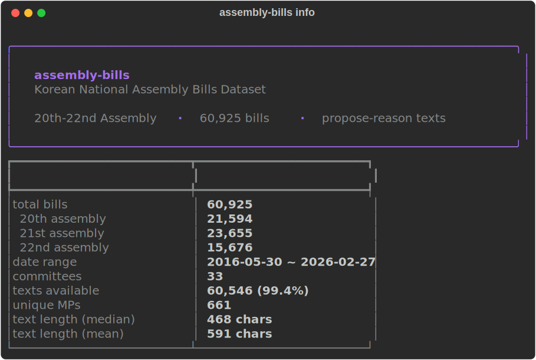

# assembly-bills

60,925 member-proposed bills from the 20th-22nd Korean National Assembly (2016-2026), with full propose-reason texts.

```
20th Assembly   21,594 bills   2016-05 ~ 2020-05
21st Assembly   23,655 bills   2020-06 ~ 2024-05
22nd Assembly   15,676 bills   2024-06 ~ 2026-02
```

The propose-reason text (제안이유) was scraped in full from the [National Assembly Legislative Information System](https://likms.assembly.go.kr/bill/main.do). 99.4% of bills have text available. This is the first publicly available dataset containing the full propose-reason texts for Korean legislative bills.

<picture>
  
</picture>

---

## Quickstart

### Option A: CLI

```bash
pip install korean-assembly-bills
```

> If `pip` doesn't work, try `pip3 install korean-assembly-bills` or `python3 -m pip install korean-assembly-bills`. This is common on macOS where `pip` may not be in your PATH.

```bash
assembly-bills info                          # dataset summary
assembly-bills search "인공지능"              # search by keyword
assembly-bills search "부동산" --age 21       # filter by assembly
assembly-bills show 2124567                   # view a bill + full text
assembly-bills mp "이재명"                    # look up an MP's bills
assembly-bills stats --by party              # statistics
assembly-bills export ai.csv --keyword "인공지능" --with-text
```

### Option B: Python

```python
import pandas as pd

bills = pd.read_parquet("data/bills.parquet")
texts = pd.read_parquet("data/bill_texts.parquet")

# merge metadata and text
df = bills.merge(texts[["BILL_ID", "propose_reason"]], on="BILL_ID", how="left")
print(df.shape)  # (60925, 25)
```

### Option C: Interactive App

```bash
pip install korean-assembly-bills[app]
streamlit run app.py
```

---

## Data Format

All files are in Apache Parquet format (compressed with zstd). Parquet is a columnar format that is 5-30x smaller than CSV, faster to load, and preserves data types. It is natively supported by pandas, polars, R (arrow), and most data tools.

### Reading Parquet files

**Python (pandas)**
```python
import pandas as pd
df = pd.read_parquet("data/bills.parquet")
```

**Python (polars)**
```python
import polars as pl
df = pl.read_parquet("data/bills.parquet")
```

**R**
```r
library(arrow)
df <- read_parquet("data/bills.parquet")
```

**DuckDB (SQL)**
```sql
SELECT * FROM read_parquet('data/bills.parquet') LIMIT 10;
```

If you need CSV, use the CLI export command:
```bash
assembly-bills export all_bills.csv
assembly-bills export all_with_text.csv --with-text
```

---

## Data Dictionary

### bills.parquet

Bill metadata from the Open National Assembly API. 60,925 rows, 24 columns.

| Column | Type | Description |
|--------|------|-------------|
| `BILL_ID` | str | Unique bill identifier (e.g. `PRC_R2A0X...`) |
| `BILL_NO` | int | Bill number |
| `BILL_NAME` | str | Bill title |
| `COMMITTEE` | str | Assigned standing committee |
| `PROPOSE_DT` | str | Date proposed (YYYY-MM-DD) |
| `PROC_RESULT` | str | Processing result (e.g. 원안가결, 수정가결, 임기만료폐기) |
| `AGE` | int | Assembly number (20, 21, 22) |
| `DETAIL_LINK` | str | Link to bill detail page |
| `PROPOSER` | str | Lead proposer name + count |
| `MEMBER_LIST` | str | Link to full member list |
| `RST_MONA_CD` | str | Lead proposer's MP code |
| `COMMITTEE_ID` | str | Committee code |
| `CMT_PROC_RESULT_CD` | str | Committee processing result |
| `CMT_PROC_DT` | str | Committee processing date |
| `CMT_PRESENT_DT` | str | Committee presentation date |
| `COMMITTEE_DT` | str | Committee referral date |
| `PROC_DT` | str | Final processing date |
| `LAW_PROC_DT` | str | Judiciary committee processing date |
| `LAW_PROC_RESULT_CD` | str | Judiciary committee result |
| `LAW_PRESENT_DT` | str | Judiciary committee presentation date |
| `LAW_SUBMIT_DT` | str | Judiciary committee submission date |
| `RST_MONA_CD` | str | Lead proposer member code |
| `PUBL_MONA_CD` | str | Public proposer codes (semicolon-separated) |
| `RST_PROPOSER` | str | Lead proposer display name |
| `PUBL_PROPOSER` | str | Public proposer display names |

### bill_texts.parquet

Propose-reason texts scraped from the legislative information system. 60,925 rows, 3 columns.

| Column | Type | Description |
|--------|------|-------------|
| `BILL_ID` | str | Matches `bills.parquet` |
| `propose_reason` | str | Full propose-reason text (제안이유). Median 468 chars, max 14,445. |
| `scrape_status` | str | `ok` (99.4%), `no_csrf`, `empty`, or `error` |

### proposers.parquet

Individual proposer records linking MPs to bills. 769,773 rows, 14 columns.

| Column | Type | Description |
|--------|------|-------------|
| `BILL_ID` | str | Matches `bills.parquet` |
| `BILL_NO` | int | Bill number |
| `BILL_NM` | str | Bill name |
| `PPSL_DT` | str | Proposal date |
| `PPSR_NM` | str | Proposer name |
| `PPSR_POLY_NM` | str | Party name |
| `PPSR_CH_NM` | str | Chinese characters of name |
| `REP_DIV` | str | `대표발의` for lead proposer, null for co-sponsor |
| `PPSR_ROLE` | str | Role (발의자) |
| `PPSR_KIND` | str | Proposer type (의원) |
| `PPSR_CN` | str | Proposer serial number |
| `NASS_CD` | str | MP code |
| `ERACO` | int | Assembly number |
| `_bill_id` | str | Original BILL_ID from API |

### mp_metadata.parquet

MP biographical information. 947 rows (661 unique MPs across 20th-22nd assemblies), 16 columns. Sourced from the `ALLNAMEMBER` API endpoint with per-assembly party data from `BILLINFOPPSR`.

| Column | Type | Description |
|--------|------|-------------|
| `_age` | int | Assembly number (20, 21, 22) |
| `MONA_CD` | str | Unique MP code (matches `NASS_CD` in proposers) |
| `HG_NM` | str | Name (Korean) |
| `HJ_NM` | str | Name (Chinese characters) |
| `ENG_NM` | str | Name (English) |
| `POLY_NM` | str | Party during the assembly (from bill proposals) |
| `ELECT_POLY_NM` | str | Party at time of election (may differ due to party renames) |
| `ORIG_NM` | str | Electoral district |
| `ELECT_GBN_NM` | str | Election type (지역구/비례대표) |
| `CMIT_NM` | str | Standing committee |
| `SEX_GBN_NM` | str | Gender (남/여) |
| `BTH_DATE` | str | Birth date |
| `REELE_GBN_NM` | str | Seniority (초선, 재선, 3선, ...) |
| `n_bills` | int | Total bills proposed (lead + co-sponsor) |
| `n_lead` | int | Bills led as primary proposer |
| `BRF_HST` | str | Brief career history |

---

## CLI Reference

```
assembly-bills [COMMAND] [OPTIONS]
```

| Command | Description |
|---------|-------------|
| `info` | Dataset summary statistics |
| `search KEYWORD` | Search bills by name or text |
| `show BILL_NO` | Full detail view of a bill |
| `mp NAME` | Look up an MP and their bills |
| `stats` | Count statistics with bar charts |
| `export PATH` | Export to CSV or Parquet |

### search options

```
-n, --limit N       Max results (default 20)
--age N             Filter by assembly (20, 21, 22)
--committee TEXT    Filter by committee (substring)
--party TEXT        Filter by party (substring)
--text              Also search in propose-reason texts
```

### export options

```
--keyword TEXT      Filter by keyword
--age N             Filter by assembly
--with-text         Include propose-reason text
--format [csv|parquet]  Output format (default csv)
```

---

## Data Collection

The data was collected from two sources:

1. **Open National Assembly API** (`open.assembly.go.kr`): Bill metadata, proposer lists, and MP information. APIs used:
   - `nzmimeepazxkubdpn` (bill list)
   - `BILLINFOPPSR` (proposer list)
   - `nwvrqwxyaytdsfvhu` (MP metadata)

2. **Legislative Information System** (`likms.assembly.go.kr`): Propose-reason texts were scraped from bill detail pages. The scraping process:
   - GET the bill detail page to obtain a CSRF token
   - POST with the full form parameters to retrieve the `<pre id="prntSummary">` content
   - This two-step process is necessary because the API does not provide the propose-reason text

All 60,925 bills across the 20th-22nd assemblies were scraped, with a 99.4% success rate (60,546 texts obtained).

---

## Use Cases

- **Legislative text analysis**: NLP on Korean legislative language, topic modeling, text similarity
- **Political science research**: MP productivity, party differences, committee dynamics
- **AI impact studies**: Compare legislative texts before and after ChatGPT (Nov 2022)
- **Network analysis**: Co-sponsorship networks from the proposers table

---

## Citation

If you use this dataset in academic work, please cite:

```bibtex
@misc{yang2026assemblybills,
  author = {Yang, Kyusik},
  title = {Korean National Assembly Bills Dataset (20th-22nd Assembly)},
  year = {2026},
  publisher = {GitHub},
  url = {https://github.com/kyusik-yang/korean-assembly-bills}
}
```

---

## License

CC BY 4.0. The underlying legislative data is public information from the Korean National Assembly.

## Related Projects

- [open-assembly-mcp](https://github.com/kyusik-yang/open-assembly-mcp) -- MCP server for Korean National Assembly data
- [assembly-explorer](https://national-assembly-kr.streamlit.app) -- Interactive explorer for Korean legislative data

---

<sub>Built with [Claude Code](https://claude.ai/claude-code). To study bills, you need API bills.</sub>
